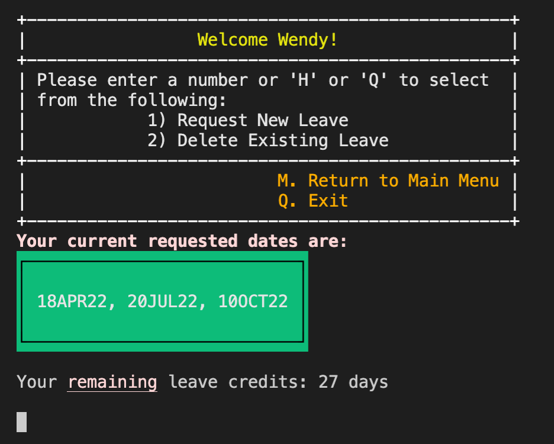

# T1A3 - Terminal Application (Christopher Chong)
---

 ## Link to Source Control Repository

Github link(GitHub: Where the world builds software, 2022):

https://github.com/chrismyhub/terminal_app

---

## Code Style Guide
This Terminal Application will be adhering to Rubocop guidelines (The Ruby Style Guide, 2022).
  

---
## Features	
This Terminal Application will have the following features:

1. Display Staff current Annual Leave and Credits.
   - This feature will allow the user to retrieving leave details from the existing database.




2. Manage Staff Name (Create - save new name/Update - rename/Delete -name)
   - This feature includes:
  
     - Create new staff - New staff member will enter name, role and password and the app will auto-generate a unique Staff ID to be used for requesting and deleting leave as well as update staff name and password.  These details will be automatically added to the existing staff database.
  
     - Updating Existing Staff Name and Password - Staff login used for validating user before allowing changes to name or password in the existing database.  User input for user name and password would go through valid validation conditions (i.e. empty entries).
  
     - Deleting Existing Staff -  Staff login used for validating user, only existing staff can be deleted in the existing database.


1. Manage Staff Annual Leave (Create/Delete)
   - This feature includes:

     - Requesting Leave - Staff login used for validating user and a date validation before leave is requested.  Date validation includes, database checking for double booking of same staff member and for minimum required staff at work. 
  
     - Deleting Existing Leave - Staff login used for validating user, only existing requested leave can be deleted through database checking.  


1. Manage staff login (password validation)
   - Staff ID and password are validated through database checking and confirming they exist and their credentials match. 


5. Exit Option from Main/Leave Menu
   - To log out from the app after user has finished with it.


---
## Implementation Plan	
My implementation plan consists of writing out user stories, drawing out a class diagram using Draw.io (draw.io – Diagrams for Confluence and Jira, 2022) and utilising Trello for Agile project management.  In Trello I have made cards for each feature and broken these down into smaller tasks to complete.  Once a task is complete they move across the Trello board.  From 'to do', 'in progress', 'testing', 'completed' and then 'deployed'.  Trello helps me visualise my progress daily.  I've also been using GitHub for regular commits from Visual Studio Code (VSC).  

Main design points for the app:
- Everything feeds into Menu (navigation), then feeds into Main.
- Two databases, one for staff details and one for leave dates.
- Each page contains Help menu and Exit option.
- Constants and Validation classes separated from main source code, to allow values to be added/updated from one point of entry.
- User input is in a seperate class to keep the code DRY.


I will be using Trello (Trello, 2022) to track it.

### Screenshots of progress


---
## HELP Documentation

### Steps to install the application
1. If you do not have Ruby installed on your computer, please follow the installation instructions here(Installing Ruby, 2022):
   https://www.ruby-lang.org/en/documentation/installation/

2. If you do not have bundler installed on your computer, please run the following command line in Terminal to install the necessary Ruby Gems:
```install bundler```

3. Clone the files from the following repository by using the following command line instruction:
```git clone https://github.com/chrismyhub/terminal_app```

4. From here please navigate to the src folder from where you have cloned the repository:
```cd src```

5. To run the Teams Leave App please type ```./run_teams_leave_app.sh``` in Terminal or ```ruby main.rb```

### Application dependancies
1. Ruby
2. Ruby Gems:
   - rainbow
   - tty-font
   - terminal-basic-menu
   - tty-box
   - RSPEC
   - Bundler

### System/Hardware requirements
This app was created and tested using Visual Studio Code version 1.65.2, with Ruby version 3.1.0.  Teams Leave App was run without issues on macOS Monterey with Apple M1 using 8gb RAM.

### Command line arguments
- To run The Teams Leave Application in Terminal, type ```./run_teams_leave_app.sh```  


- To access help in command line, type ```ruby main.rb -h```


- To access information on the app in command line, type ```ruby main.rb -i```


- To access information on Ruby Gems in command line, type ```ruby main.rb -g```


  

 ---
 ## <u>REFERENCED SOURCES</u>
<br>
<font size="1">
1.  Rubystyle.guide. 2022. The Ruby Style Guide. [online] Available at: < https://rubystyle.guide/ > [Accessed 30 March 2022].
<br>
<br>
2.  Trello.com. 2022. Trello. [online] Available at: < https://trello.com/ > [Accessed 30 March 2022].
<br>
<br>
3.  Ruby-lang.org. 2022. Installing Ruby. [online] Available at: < https://www.ruby-lang.org/en/documentation/installation/ > [Accessed 3 April 2022].
<br>
<br>
4.  GitHub. 2022. GitHub: Where the world builds software. [online] Available at: < https://github.com/ > [Accessed 3 April 2022].
<br>
<br>
5.  draw.io. 2022. draw.io – Diagrams for Confluence and Jira. [online] Available at: < https://drawio-app.com/ > [Accessed 3 April 2022].
<br>
<br>


